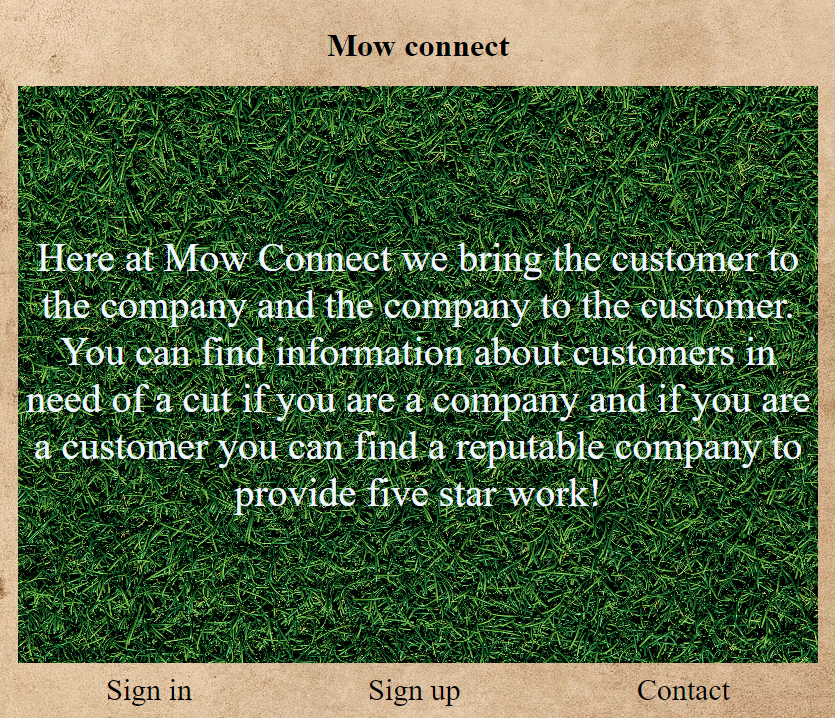
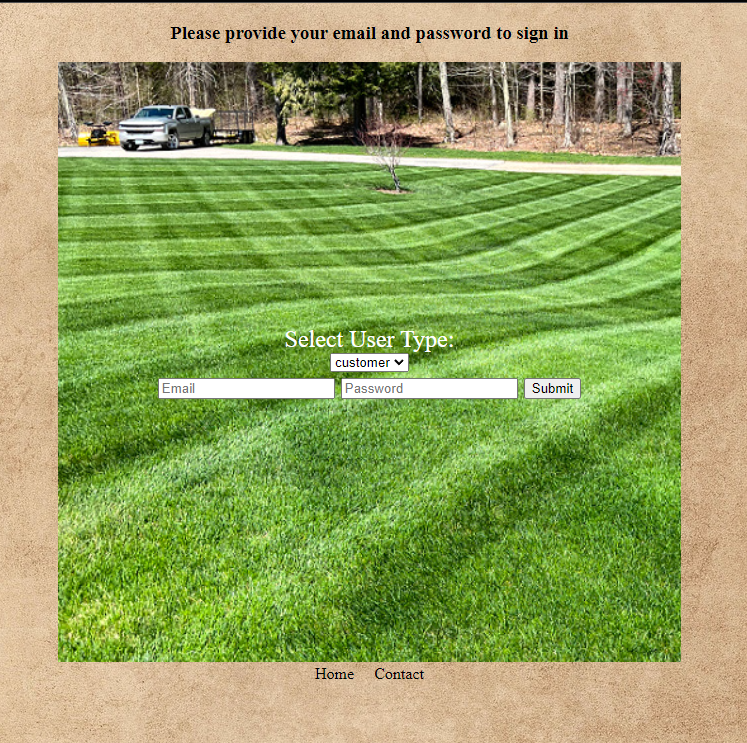
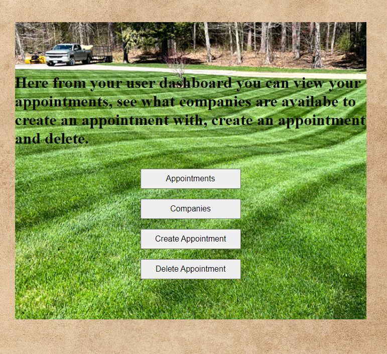
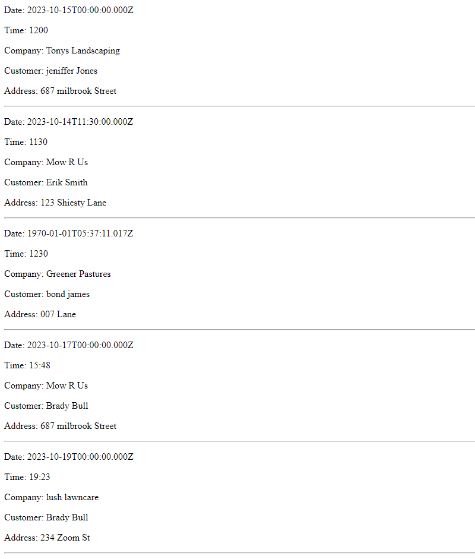

# mow-connect
In this application I want to connect customers with companies in a user friendly way. Have you ever recieved a busnes card from a small lawncare or landscaping company and use them for an ammount of time and lose contact over winter? Or the opposite as a company, are you always looking for customers or writing names and numbers on paper or in an excell sheet? If so we have a solution! In our webpage we hold information and give it to our users so you never have to look for cutomers or lawmcare companies again!
## Technologies
JavaScript, Mongoose, MongoDB, Express
## ERD
Click [here](https://lucid.app/lucidchart/5b06cb8f-d9d4-4e5e-8541-71bc87e9e674/edit?viewport_loc=-2136%2C51%2C3072%2C1537%2C0_0&invitationId=inv_4a975c5b-2024-4353-9f2a-b959c7118272) to see the ERD made in lucidchart.
## FLow chart
Click [here](https://lucid.app/lucidchart/4c7b53ad-eb0b-4d7b-8c37-cf92470ef484/edit?view_items=HCAD7A.S60Hl&invitationId=inv_97fccc94-bdc0-4a31-b761-949dc2a57c55)
# Images

